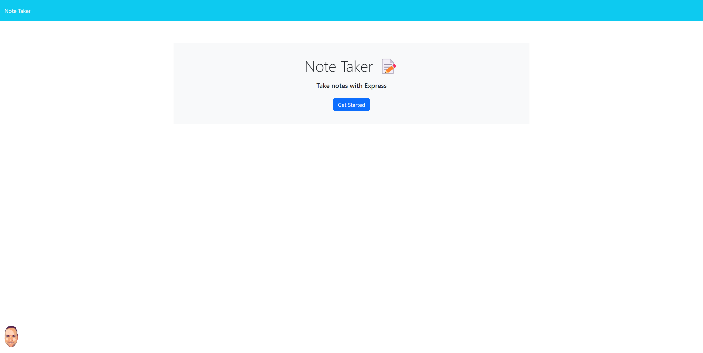
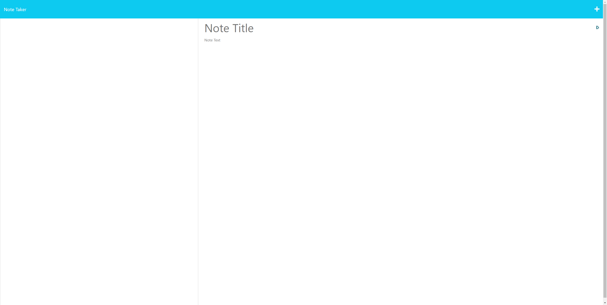

# Note Taker

 
     
## Description
This app helps users keep track of notes. 
Once the note is no longer needed they can remove the note. 
They can also amend the note if something changes. 
 
Please note some functionality is not currently available due to a lack of time available this week. I hope to resubmit this assigment in the coming weeks.
 
## Table of Contents
* [Installation](#installation)
* [Usage](#usage)
* [License](#license)
* [Screenshots](#Screenshots)
* [Questions](#questions)
 
## Installation
The app is live and delpoyed on as a website on Heroku. 
 
## Usage
Open the website https://aaronsnotetaker.herokuapp.com/. 
 
## Licence    
 
Name: MIT 
Further information about this licence can be found here; https://opensource.org/licenses/MIT 
 
## Screenshots
 
 
 

## Questions
If you have any questions or comments about this README, please contact me via email; [aaron.raikes@gmail.com](mailto:aaron.raikes@gmail.com) 
You can also see my other GitHub projects here; [https://github.com/aaronqwerty](https://github.com/aaronqwerty) 